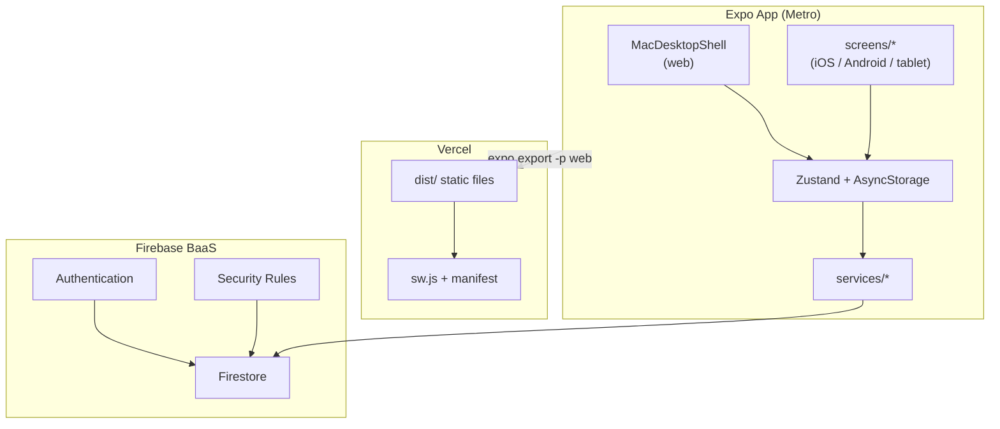

<div align="center">

# Languageeee: Fanfiction & Language Cloud Ecosystem

**Expo-приложение для изучения языков через чтение фанфиков и пользовательских текстов.**

Одна кодовая база на **React Native + React Native Web**: в браузере — десктопный shell с glassmorphism, на планшете/телефоне — нативные экраны. Данные живут локально (AsyncStorage) и синхронизируются в **Firebase Firestore** после входа.

<br />


<br />

**Dark Neon UI** · Deep Obsidian `#0D0D11` · Glassmorphism · Animated Starfield

[О проекте](#-что-это-на-самом-деле) ·
[Features](#-возможности) ·
[Stack](#-технический-стек) ·
[Architecture](#-архитектура) ·
[Запуск](#-локальный-запуск)

</div>

---

##  Что это на самом деле

| | |
|---|---|
| **Тип** | Cross-platform **Expo 53** app (React Native 0.79 + React Native Web) |
| **Сборка** | **Metro bundler** → статический экспорт (`expo export -p web`) → хостинг на **Vercel** |
| **Backend** | Только **Firebase BaaS** (Auth + Firestore). Собственного API-сервера нет |
| **UI по платформам** | `Platform.OS === 'web'` → `MacDesktopShell` · иначе → экраны в `src/screens/` |
| **Языки изучения** | 🇨🇳 中文 · 🇬🇧 English · 🇷🇺 Русский |
| **Язык интерфейса по умолчанию** | Русский (`DEFAULT_NATIVE_LANGUAGE = 'ru'`), переключается на zh / en |
| **Без аккаунта** | Гостевой режим: книги и прогресс только локально, облако недоступно |

> **Это не Next.js** и не классический React SPA с React Router.  
> Это React Native-приложение, которое на web рендерится через `react-native-web` и деплоится как статика.

---

##  О проекте

**Languageeee** — интерактивная читалка, где каждое слово кликабельно: пиньинь, перевод, TTS, HSK-уровень, грамматика. Пользователь загружает `.txt`, выбирает историю из каталога или открывает публичную подборку по ссылке `/c/{slug}`, читает, собирает словарь и повторяет карточки по алгоритму **SM-2**.

Визуальный стиль — **тёмная неоновая эстетика**: фон `#0D0D11`, стеклянные панели, розовый пиньинь `#FF6584`, звёздное небо и lofi-радио на web.

---

##  Возможности

###  Читалка (`ReaderScreen` / `ReaderPanel`)

- Сегментация текста через **`Intl.Segmenter('zh-CN', { granularity: 'word' })`** + **LMF/FMM** по словарям HSK и БКРС (`chineseTokenizer.ts`) — без лагов на планшетах.
- Отдельные пайплайны токенизации для **en** и **ru** (`englishTokens.ts`).
- Пиньинь / транскрипция цветом `#FF6584`, переключение упрощённый ↔ традиционный (`opencc-js`).
- Модальное окно слова: перевод, озвучка (`expo-speech`), коллекции, SRS-карточки, паттерны HSK-грамматики.
- Параллельный перевод абзацев (lazy, по запросу).

### Библиотека и каталог

- **Моя библиотека** — загрузка текстов, папки-подборки, поиск с debounce.
- **Каталог** — публичные истории с фильтрами (язык, HSK, категория, тег).
- **Публичные подборки** — шаринг по URL `/c/{slug}`.

###  Карточки и прогресс

- Flashcards с интервалами **SuperMemo-2** (`srsService.ts`).
- Автосохранение позиции чтения: локально → Firestore с **debounce 800 ms** (`scheduleReadingProgressSync`).
- Streak-трекер и аналитика активности по дням.

###  Облако и auth

- **Firebase Auth**: Email/Password + Google (redirect на web).
- **Firestore sync**: книги, подборки, карточки, прогресс, sticky notes — merge с tombstones и conflict resolution (`cloudSyncService.ts`).
- **Security Rules** + клиентский **RBAC** (`firestore.rules`, `rbac.ts`).

###  PWA (web)

- Service Worker (`public/sw.js`) — precache shell, offline-first.
- Web Manifest, иконки 192/512, установка на домашний экран.
- Cache-заголовки настроены в `vercel.json`.

###  Web-only extras

- `MacDesktopShell` — dock, glass-окна, onboarding tour.
- `LofiRadioPlayer`, `StickyNotes`, `StarryBackground`.

---

##  Технический стек

| Слой | Реальные технологии |
|------|---------------------|
| **App framework** | Expo SDK 53, React 19, React Native 0.79, React Native Web |
| **Язык** | TypeScript 5.8 |
| **Стили (web)** | Tailwind CSS 3 → `global.generated.css`, PostCSS, Autoprefixer |
| **Состояние** | Zustand 5 + persist (AsyncStorage / localStorage) |
| **Backend** | Firebase 11: Authentication, Cloud Firestore, Security Rules |
| **NLP / перевод** | `Intl.Segmenter`, `pinyin-pro`, `opencc-js`, OpenAI / OpenRouter (опционально), MyMemory / gtx proxy |
| **Деплой** | Vercel: `npm run vercel-build` → `dist/` |
| **Runtime** | Node.js 24.x |

### npm-скрипты (из `package.json`)

| Скрипт | Что делает |
|--------|------------|
| `npm run dev` | `expo start --web` |
| `npm run web` | Tailwind build + `expo start --web --offline` |
| `npm run export:web` | Production static export в `dist/` |
| `npm run vercel-build` | То же, что `export:web` (CI на Vercel) |
| `npm run android` / `ios` | Expo dev client (offline) |
| `npm run firebase:rules` | Деплой Firestore rules |

---

##  Архитектура

### Два UI-слоя, один домен

```
App.tsx
├── Platform.OS === 'web'  →  MacDesktopShell  →  src/web/*  (Tailwind, DOM helpers)
└── Platform.OS !== 'web'  →  src/screens/*    (StyleSheet RN)
         ↓
    src/services/*  +  src/store/useAppStore.ts  (общая бизнес-логика)
```

### Решённые инженерные задачи

**1. N+1 запросов перевода**

Перевод — lazy (по клику), не при рендере абзаца. Кэш in-memory + persisted, до 500 записей (`translationCache.ts`).

**2. Кривая сегментация китайского на мобильных**

`Intl.Segmenter` + LMF по HSK/БКРС + расклейка местоимений「我/你/他» (`chineseTokenizer.ts`).

**3. Гонки при sync прогресса чтения**

Scroll не триггерит полный sync — только debounced push `readingProgress` в `users/{uid}/meta/sync` (800 ms).

**4. Доступ к данным в Firestore**

Rules проверяют `userId === auth.uid`; клиент дублирует проверки через `rbac.ts` до write.



---

##  Структура репозитория

```
languageeee/
├── App.tsx                      # Entry: Platform.OS → web shell или RN screens
├── app.config.js                # Expo config + EXPO_PUBLIC_FIREBASE_* в extra
├── metro.config.js              # Metro (web compat, zustand ESM)
├── vercel.json                  # Static hosting, SW headers, SPA rewrites
├── firestore.rules              # Firestore Security Rules
├── public/
│   ├── sw.js                    # Service Worker
│   └── manifest.json            # PWA manifest
├── scripts/                     # Python: извлечение HSK из PDF, генерация TS
├── src/
│   ├── screens/                 # RN-экраны (tablet / mobile)
│   ├── web/                     # Web-only UI (MacDesktopShell, ReaderPanel, …)
│   ├── components/              # Общие компоненты (AuthStatusBar, HskAnalysis, …)
│   ├── services/                # Auth, sync, tokenizer, translation, SRS, TTS
│   ├── store/                   # Zustand store + persist
│   ├── i18n/                    # UI-строки (zh / en / ru)
│   ├── data/                    # HSK words, grammar JSON, zh-ru dict
│   └── styles/                  # Tailwind source → generated CSS
└── hsk3_words.json              # Исходные данные HSK
```

---

##  Локальный запуск

### Требования

- **Node.js** 24.x (см. `engines` в `package.json`)
- **npm** 10+

### 1. Клонирование

```bash
git clone https://github.com/KariHoran/languageeee.git
cd languageeee
```

### 2. Зависимости

```bash
npm install
```

### 3. `.env` (опционально, но нужен для облака)

Создайте `.env` в корне:

```env
# Firebase — без этого работает только гостевой локальный режим
EXPO_PUBLIC_FIREBASE_API_KEY=
EXPO_PUBLIC_FIREBASE_AUTH_DOMAIN=
EXPO_PUBLIC_FIREBASE_PROJECT_ID=
EXPO_PUBLIC_FIREBASE_STORAGE_BUCKET=
EXPO_PUBLIC_FIREBASE_MESSAGING_SENDER_ID=
EXPO_PUBLIC_FIREBASE_APP_ID=

# AI-перевод (опционально)
EXPO_PUBLIC_OPENAI_API_KEY=
EXPO_PUBLIC_OPENROUTER_API_KEY=
```

После изменения `.env` перезапустите с очисткой кэша:

```bash
npm run web:clear
```

### 4. Dev-сервер

```bash
npm run dev
```

Откройте URL из вывода Expo (обычно `http://localhost:8081`).

---

##  Design Tokens

| Token | Value | Где |
|-------|-------|-----|
| Фон | `#0D0D11` | `app.json` splash, web theme |
| Пиньинь | `#FF6584` | `src/styles/global.css`, `theme/y2k.ts` |
| Glass | `backdrop-blur` + полупрозрачные бордеры | `src/web/GlassWindow.tsx`, `.glass` в CSS |

---

##  Лицензия

Pet-project. All rights reserved.

---

<div align="center">

**🌸 Читай фанфики — учи язык**

</div>
