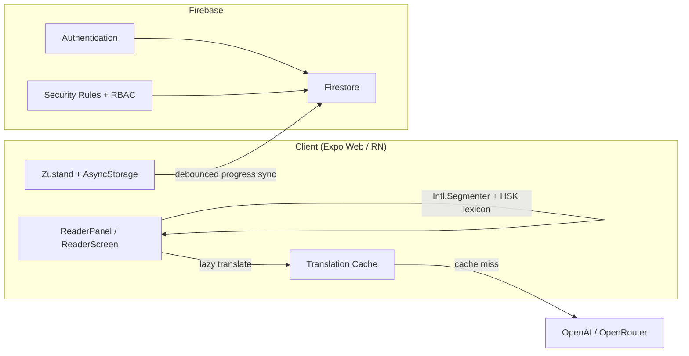

<div align="center">

# 🌸 Languageeee: Fanfiction & Language Cloud Ecosystem

**Облачная платформа для изучения языков и чтения пользовательского контента с кросс-устройной синхронизацией в реальном времени.**

Приложение превращает чтение фанфиков и новелл в интерактивный языковой тренажёр — **китайский**, **английский**, **русский** — с мгновенным разбором слов, идиом и грамматики прямо в тексте.

<br />


<br />

**Dark Neon UI** · Deep Obsidian `#0D0D11` · Glassmorphism · Animated Starfield

[Features](#-ключевые-возможности) ·
[Stack](#-технический-стек) ·
[Architecture](#-архитектурные-вызовы-и-решения) ·
[Getting Started](#-локальный-запуск)

</div>

---

## ✨ О проекте

**Languageeee** — pet-проект уровня production-ready SPA: единая кодовая база на **Expo / React Native Web** для браузера, планшета и мобильных устройств. Пользователь загружает или выбирает историю из публичного каталога, читает с интерактивной сегментацией текста, сохраняет слова в коллекции и карточки SRS, а прогресс автоматически синхронизируется через **Firebase Firestore**.

Визуальный язык — **тёмная неоновая эстетика**: глубокий обсидиановый фон, стеклянные панели, мягкий розовый пиньинь `#FF6584` и анимированное звёздное небо на десктопе.

---

## 🚀 Ключевые возможности

### 📖 Интерактивная читалка (E-reader)

- Локальная сегментация текста через **`Intl.Segmenter('zh-CN', { granularity: 'word' })`** — мгновенный разбор фраз и идиом (**成语**) без лагов на планшетах и мобильных устройствах.
- Дополнительный **Longest-Match-First** по словарям HSK / БКРС для склейки известных лексем и корректной расклейки местоимений.
- Нежно-розовый **пиньинь / транскрипция** поверх текста (`#FF6584`).
- Модальное окно слова: перевод, TTS, добавление в коллекцию, SRS-карточки, грамматические паттерны HSK.

### ☁️ Облачный трекер прогресса

- Автосохранение позиции чтения в **Firebase Firestore** с **debounce 800 ms** — синхронизация между устройствами без гонок запросов (race conditions).
- Локальный кэш в AsyncStorage / `localStorage` + flush при reconnect (offline-first).

### 📚 Публичная библиотека и i18n

- Каталог историй с фильтрами по языку, уровню HSK, категории и тегам.
- Мультиязычная локализация интерфейса: **zh**, **en**, **ru** (`src/i18n/`).

### 📱 PWA (Progressive Web App)

- **Offline-first**: Service Worker, precache, установка на домашний экран как нативное приложение.
- Отдельные cache-заголовки для `sw.js`, `manifest.json` и immutable assets (Vercel).

### 🎯 Геймификация и аналитика

- **Streak-трекер** ежедневной активности.
- Аналитика продуктивности: уникальные слова, процент прочитанного, сессии чтения.

---

## 🛠 Технический стек

| Слой | Технологии |
|------|------------|
| **Frontend** | React 19, Expo 53 (React Native Web), TypeScript, Tailwind CSS, Zustand |
| **Backend & DB** | Firebase Authentication, Cloud Firestore, Security Rules |
| **AI / NLP** | OpenAI / OpenRouter (lazy translation), `pinyin-pro`, `opencc-js`, `Intl.Segmenter` |
| **DevOps** | Vercel CI/CD (`vercel-build` → `expo export -p web`), Node.js 24 |
| **Platform APIs** | PWA (SW, Web Manifest), Expo Speech, AsyncStorage |

---

## 🏗 Архитектурные вызовы и решения

> Раздел для рекрутеров и code review — какие нетривиальные проблемы решались и как.

### 1. N+1 запросов перевода → Lazy Translation + кэш

**Проблема:** пословный перевод каждого токена при открытии абзаца генерировал лавину API-запросов.

**Решение:**

- Перевод по требованию (lazy) — только при клике на слово или явном запросе.
- Двухуровневый **translation cache** (in-memory + persisted, до 500 записей) в `translationCache.ts`.
- Батчинг и дедупликация в `translationService` / `nativeTranslationService`.

### 2. Посимвольный разбор на мобильных → нативная сегментация

**Проблема:** fallback-алгоритмы на слабых движках рвали 成语 и склеивали「我是」「我要」.

**Решение:**

- Приоритет **`Intl.Segmenter`** с locale-aware конфигом (`languageConfig.ts`).
- FMM / LMF поверх сегментатора с лексиконом HSK и БКРС (`chineseTokenizer.ts`).
- Отдельные пайплайны для **en** и **ru** (`englishTokens.ts`).

### 3. Race conditions при sync → debounced cloud writes

**Проблема:** каждый scroll event мог триггерить полный upload в Firestore.

**Решение:**

- Лёгкий **`scheduleReadingProgressSync()`** с debounce 800 ms — пушит только `readingProgress` в `users/{uid}/meta/sync`.
- Полная синхронизация сущностей (books, collections, flashcards) — отдельным merge-пайплайном с tombstones и conflict resolution.

### 4. Security Rules + RBAC

**Проблема:** пользовательские книги, коллекции и публичный каталог требуют строгого разграничения доступа.

**Решение:**

- Firestore Rules: `isPathOwner`, `isDocOwner`, `createWithOwnUserId`, `keepsOwnUserId`.
- Клиентский RBAC-слой (`rbac.ts`) с каноническим `userId` / `authorId` и проверкой владельца до write-операций.



---

## 📁 Структура проекта

```
languageeee/
├── App.tsx                 # Entry point
├── src/
│   ├── screens/            # Mobile / tablet screens
│   ├── web/                # Desktop shell (MacDesktopShell, ReaderPanel, …)
│   ├── services/           # Firebase, sync, translation, tokenizer, SRS
│   ├── store/              # Zustand global state
│   ├── i18n/               # UI localization (zh / en / ru)
│   ├── data/               # HSK words, grammar patterns, catalog
│   └── styles/             # Tailwind + global CSS tokens
├── public/                 # PWA manifest, service worker, icons
├── firestore.rules         # Firestore Security Rules
└── vercel.json             # Vercel deploy config
```

---

## 🏁 Локальный запуск

### Требования

- **Node.js** 24.x
- **npm** 10+
- (Опционально) аккаунт Firebase и API-ключ OpenAI / OpenRouter

### 1. Клонирование

```bash
git clone https://github.com/<your-username>/languageeee.git
cd languageeee
```

### 2. Установка зависимостей

```bash
npm install
```

### 3. Переменные окружения

Создайте файл `.env` в корне проекта:

```env
# Firebase (обязательно для облака и auth)
EXPO_PUBLIC_FIREBASE_API_KEY=
EXPO_PUBLIC_FIREBASE_AUTH_DOMAIN=
EXPO_PUBLIC_FIREBASE_PROJECT_ID=
EXPO_PUBLIC_FIREBASE_STORAGE_BUCKET=
EXPO_PUBLIC_FIREBASE_MESSAGING_SENDER_ID=
EXPO_PUBLIC_FIREBASE_APP_ID=

# AI-перевод и анализ (опционально)
EXPO_PUBLIC_OPENAI_API_KEY=
EXPO_PUBLIC_OPENROUTER_API_KEY=
```

> Без Firebase-параметров приложение работает **локально** (AsyncStorage). Облачная синхронизация и авторизация будут недоступны.

### 4. Запуск dev-сервера

```bash
npm run dev
```

Откройте URL из терминала Expo (обычно `http://localhost:8081`).

### Дополнительные команды

| Команда | Описание |
|---------|----------|
| `npm run web` | Web с пересборкой Tailwind CSS |
| `npm run export:web` | Production-бандл в `dist/` |
| `npm run firebase:rules` | Деплой Firestore Security Rules |

---

## 🎨 Design Tokens

| Token | Value | Назначение |
|-------|-------|------------|
| `--bg-deep` | `#0D0D11` | Deep Obsidian — основной фон |
| `--pinyin` | `#FF6584` | Пиньинь / акцент |
| Glass panels | `backdrop-blur` + полупрозрачные границы | Glassmorphism UI |

---

## 📄 Лицензия

Pet-project для портфолио. All rights reserved.

---

<div align="center">

**Built with 🌸 for language learners who read fanfiction**

</div>
